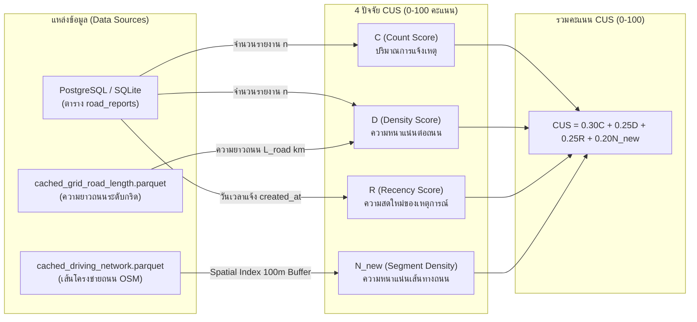

# เอกสารอธิบายระบบ CASP (Community-Aware Spatial Priority) และระบบสนับสนุนการตัดสินใจ (DSS)

เอกสารนี้รวบรวมรายละเอียดทางวิชาการ สถาปัตยกรรมระบบ สูตรการคำนวณ แหล่งที่มาของตัวแปรทั้งหมด และการออกแบบ **ระบบสนับสนุนการตัดสินใจ (Decision Support System - DSS)** ภายใต้สถาปัตยกรรม **4-Factor CUS (Revised)** ของระบบบริหารจัดการงานซ่อมบำรุงทางหลวงเทศบาล

---

## 1. บทนำและแนวคิดของ CASP

**CASP (Community-Aware Spatial Priority)** คือ ดัชนีการจัดลำดับความสำคัญของพื้นที่เชิงพื้นที่ (Spatial Prioritization Index) ที่ผสมผสานระหว่าง:
1. **มิติวิศวกรรมและความเสียหายทางกายภาพ ($avg\_ppi$):** ประเมินจากโมเดลปัญญาประดิษฐ์ (AI/Random Forest)
2. **มิติสังคม ชุมชน และบริบทเชิงพื้นที่ ($CUS$):** ประเมินจากความเดือดร้อนของประชาชน ความหนาแน่นของปัญหา และความสำคัญของโครงข่ายถนน

ระบบจะแบ่งพื้นที่ศึกษาออกเป็น **กริดสี่เหลี่ยมจัตุรัสคงที่ขนาด 100 × 100 เมตร (Fixed Grid 100m)** และคำนวณคะแนนความเร่งด่วนรวม (Overall Priority) เพื่อช่วยให้ผู้บริหารและวิศวกรจัดสรรงบประมาณและทีมซ่อมบำรุงได้อย่างแม่นยำและคุ้มค่าสูงสุด

---

## 2. สูตรการคำนวณภาพรวม (Overall Priority Formula)

$$Overall = (W_{PPI} \times avg\_ppi) + (W_{CUS} \times CUS)$$

### ค่าน้ำหนักมาตรฐาน (Default Baseline Weights):
- **$W_{PPI} = 0.80$ (80%):** น้ำหนักความเสียหายจริงทางวิศวกรรม
- **$W_{CUS} = 0.20$ (20%):** น้ำหนักผลกระทบชุมชนและบริบทพื้นที่
- *หมายเหตุ: ค่าน้ำหนักทั้งสองตัวสามารถปรับเปลี่ยนได้แบบ Dynamic ผ่านระบบสนับสนุนการตัดสินใจ (DSS)*

### การจำแนกระดับความเร่งด่วน (Priority Levels & Color Codes):
| ช่วงคะแนน (Overall) | ระดับความเร่งด่วน | รหัสสี | การดำเนินการ |
| :---: | :---: | :---: | :--- |
| **75.0 – 100.0** | **Critical (วิกฤต)** | `#ff4d4f` (แดง) | ส่งทีมเข้าซ่อมแซมทันที มีความเสี่ยงอุบัติเหตุสูง |
| **50.0 – 74.9** | **High (เร่งด่วนสูง)** | `#fa8c16` (ส้ม) | จัดเข้าแผนงานซ่อมบำรุงรอบสัปดาห์ |
| **0.0 – 49.9** | **Low (ต่ำ/ปกติ)** | `#52c41a` (เขียว) | ติดตามสถานะ หรือบันทึกในแผนงานซ่อมบำรุงตามรอบปกติ |

---

## 3. ระบบกริดเชิงพื้นที่ (Spatial Grid System)

- **ขอบเขตพื้นที่ศึกษา (Study Area BBox):** บริเวณมหาวิทยาลัยเทคโนโลยีสุรนารี (มทส.) และพื้นที่โดยรอบในจังหวัดนครราชสีมา
  - Latitude: $14.85^\circ$ ถึง $14.92^\circ$ N
  - Longitude: $101.97^\circ$ ถึง $102.07^\circ$ E
- **ขนาดกริด:** ประมาณ 100 × 100 เมตร ($\Delta lat \approx 0.0009^\circ, \Delta lon \approx 0.0009^\circ$)
- **การกำหนด Grid ID:**
  $$row = \left\lfloor \frac{lat - lat_{min}}{\Delta lat} \right\rfloor, \quad col = \left\lfloor \frac{lon - lon_{min}}{\Delta lon} \right\rfloor$$
  $$\text{Grid ID} = \text{"G\_\{row\}\_\{col\}"}$$

---

## 4. รายละเอียดตัวแปรที่ 1: ค่าเฉลี่ย PPI ($avg\_ppi$)

### 4.1 ความหมายและสูตรการคำนวณ
$avg\_ppi$ คือค่าเฉลี่ยของ **Pavement Priority Index (PPI)** ของรายงานความเสียหายทั้งหมดที่เกิดขึ้นภายในกริด cell นั้นๆ:

$$avg\_ppi = \frac{1}{N_{valid}} \sum_{i=1}^{N_{valid}} PPI_i$$

โดยคะแนน PPI ของแต่ละรายงานคำนวณจาก Expected Value ของความน่าจะเป็นที่ทำนายโดย Random Forest Model:
$$PPI_i = (P_{normal} \times A_1) + (P_{warning} \times A_2) + (P_{critical} \times A_3)$$

- $P_{normal}, P_{warning}, P_{critical}$ คือ Class Probability จาก Random Forest Model (ผลรวม = 1.0)
- $A_1 = 15.0$ (คะแนนสมอระดับปกติ)
- $A_2 = 50.0$ (คะแนนสมอระดับเตือน)
- $A_3 = 85.0$ (คะแนนสมอระดับวิกฤต)
- *หมายเหตุ: รายงานที่ยังไม่มีผลวิเคราะห์ของ AI หรือค่าความน่าจะเป็นเป็น NULL จะถูกตัดออกจากการเฉลี่ย เพื่อไม่ให้ดึงคะแนนของกริดลดลงเป็น 0 อย่างไม่ถูกต้อง*

### 4.2 แหล่งที่มาของข้อมูล ($avg\_ppi$)
- **ตารางฐานข้อมูล:** `road_reports` เชื่อมโยงกับ `ai_analyses` ผ่าน SQLAlchemy
- **เงื่อนไขคัดกรอง:** เฉพาะรายงานที่มี `status = ReportStatus.COMPLETED` และพิกัด GPS อยู่ในขอบเขต BBox ของ Study Area
- **โค้ดอ้างอิง:** [app/analytics/router.py](file:///c:/Users/User/Capstone_Project/backend/app/analytics/router.py) และค่าคงที่ `PRIORITY_ANCHORS` จาก [app/ai/feature_mapping.py](file:///c:/Users/User/Capstone_Project/backend/app/ai/feature_mapping.py)

---

## 5. รายละเอียดตัวแปรที่ 2: CUS (Community Urgency Score) — สูตร 4-Factor (Revised)

### 5.1 สูตรคำนวณ CUS
$$CUS = (W_C \times C) + (W_D \times D) + (W_R \times R) + (W_N \times N_{new})$$

โดยผลรวมค่าน้ำหนัก $W_C + W_D + W_R + W_N = 1.0$ (สัดส่วนตั้งต้น: $30\%, 25\%, 25\%, 20\%$)

---

### 5.2 รายละเอียดปัจจัยทั้ง 4 ของ CUS และแหล่งที่มาของข้อมูล



---

#### 1) ปัจจัย $C$: ปริมาณการแจ้งเหตุสะสม (Count Score) — น้ำหนัก 30%
- **แนวคิด:** สะท้อนความเดือดร้อนสะสม ยิ่งมีประชาชนแจ้งเหตุในกริดเดียวกันมาก คะแนนยิ่งสูง
- **สูตรคำนวณ:**
  $$C = \min\left(\frac{N_{reports}}{N_{MAX}} \times 100, 100.0\right)$$
  โดยกำหนดเพดานคงที่ $N_{MAX} = 50$ รายงาน (หากรายงานเกิน 50 ครั้งได้คะแนนเต็ม 100)
- **แหล่งที่มาของข้อมูล:**
  - นับจำนวนแถว (Row Count) จากตาราง `road_reports` ที่ตกอยู่ในขอบเขตพิกัดของกริด cell นั้นๆ
  - กรองตามเงื่อนไขย้อนหลัง `days` (ค่าเริ่มต้น 7 วัน)

---

#### 2) ปัจจัย $D$: ความหนาแน่นของปัญหาต่อระยะทางถนน (Road Density Score) — น้ำหนัก 25%
- **แนวคิด:** แก้ปัญหาจุดบิดเบือนของกริด เช่น กริดที่มีถนนยาวเพียง 100 เมตรแต่มีหลุม 5 หลุม ย่อมมีความหนาแน่นของปัญหาอันตรายกว่ากริดที่มีถนนยาว 2 กิโลเมตร
- **สูตรคำนวณ:**
  $$Density_{raw} = \frac{N_{reports}}{L_{road}} \quad (\text{รายงาน/กิโลเมตร})$$
  $$D = \min\left(\frac{Density_{raw}}{D_{MAX}} \times 100, 100.0\right)$$
  - กำหนดเพดานความหนาแน่น $D_{MAX} = 20.0$ รายงาน/กิโลเมตร
  - *กรณีพิเศษ:* หากไม่มีข้อมูลถนนในแคช ($L_{road} = 0$) แต่มีรายงานจริง ระบบจะกำหนดให้ $Density_{raw} = D_{MAX}$ ($D = 100$) เพื่อความปลอดภัย
- **แหล่งที่มาของข้อมูล:**
  - $N_{reports}$ มาจากตาราง `road_reports`
  - $L_{road}$ (กิโลเมตร) มาจากไฟล์ [cached_grid_road_length.parquet](file:///c:/Users/User/Capstone_Project/cached_grid_road_length.parquet) ซึ่งสร้างจากการคำนวณความยาวของเส้นถนน OpenStreetMap (LineString Intersection) ภายในแต่ละกริด cell ล่วงหน้า

---

#### 3) ปัจจัย $R$: ความสดใหม่ของปัญหา (Recency Score) — น้ำหนัก 25%
- **แนวคิด:** ปัญหาที่เพิ่งเกิดขึ้นไม่นานมีความเร่งด่วนในการรับรู้และตอบสนองสูงกว่าปัญหาเก่าที่ค้างอยู่นาน โดยใช้ฟังก์ชันลดทอนแบบเอ็กซ์โพเนนเชียล (Exponential Decay)
- **สูตรคำนวณ:**
  $$Recency_i = e^{-\frac{days\_ago_i}{\tau}}$$
  $$R = \left( \frac{1}{N_{reports}} \sum_{i=1}^{N_{reports}} Recency_i \right) \times 100$$
  - $\tau = 30.0$ วัน (Half-life decay factor)
  - $days\_ago_i = \frac{now - created\_at_i}{86400 \text{ วินาที}}$
- **แหล่งที่มาของข้อมูล:**
  - คอลัมน์ `created_at` (Timestamp UTC) ของตาราง `road_reports`

---

#### 4) ปัจจัย $N_{new}$: ความหนาแน่นเส้นโครงข่ายถนนใกล้เคียง (Nearby Road Segment Density) — น้ำหนัก 20%
- **แนวคิด:** ทดแทนปัจจัย Network Connectivity เดิม สะท้อนว่ากริดนี้ตั้งอยู่บนโครงข่ายถนนที่มีเส้นทางสัญจรหนาแน่นหรือไม่
- **สูตรคำนวณ:**
  $$N_{new} = \min\left(\frac{\text{segment\_count}}{S_{MAX}} \times 100, 100.0\right)$$
  - $\text{segment\_count}$ คือจำนวนเส้นถนน (Road Segments) ในรัศมี 100 เมตรจากจุดกึ่งกลางกริด (Grid Centroid)
  - กำหนดเพดาน $S_{MAX} = 10.0$ เส้น (อ้างอิงจากการกระจายตัวของข้อมูลจริง: Mean=2.85, Median=2.0, Max=15)
- **แหล่งที่มาของข้อมูล:**
  - ฟังก์ชัน `get_nearby_road_segment_density(lat, lon, radius_meters=100.0)` ใน [app/ai/gee_integration.py](file:///c:/Users/User/Capstone_Project/backend/app/ai/gee_integration.py)
  - ใช้งาน Spatial Index (R-tree) ค้นหาและ Intersect กับ Buffer จากไฟล์ [cached_driving_network.parquet](file:///c:/Users/User/Capstone_Project/cached_driving_network.parquet)
  - ความเร็วในการประมวลผล ~6ms ต่อจุด ไม่ต้องยิง Request ภายนอก
- **ข้อกำหนดทางวิชาการ (Terminology):**
  > [!WARNING]
  > ต้องระบุชื่อปัจจัยนี้ว่า **"Nearby Road Segment Density"** ห้ามระบุว่าเป็น "Node Degree" หรือ "Network Centrality" เนื่องจากไฟล์แคชปัจจุบันเป็น Edge Segments ไม่ได้เก็บ Graph Node Topology การระบุเป็น Node Degree จะถือเป็นการกล่าวอ้างเกินจริง (Overclaiming)

---

## 6. เหตุผลการปรับปรุงสูตร (CUS Redesign Investigation)

ก่อนหน้านี้มีข้อเสนอขยาย CUS เป็น 6 ปัจจัย (เพิ่ม P, H, N) แต่ผลการตรวจสอบเชิงลึกพบปัญหาที่ต้องปรับปรุงดังนี้:

| ปัจจัยที่เคยเสนอ | ผลการตรวจสอบ | ข้อสรุปและการแก้ไข |
| :--- | :--- | :--- |
| **P (Population Impact)** | **พบ Double-counting 100%:** สูตรเดิมเสนอใช้ `community_impact_score_pi` ซึ่งมีค่าเท่ากับฟีเจอร์ `community_impact_score` ที่โมเดล Random Forest ใช้อยู่แล้ว (`feature_mapping.py:129`) หากนำมาคิดใน CUS จะทำให้สัญญาณเดียวกันถูกนับ 2 ครั้ง (ทั้งผ่าน $avg\_ppi$ 80% และ CUS 20%) | **❌ ตัดออกทั้งหมด** ไม่นำมาคำนวณใน CUS |
| **H (Hospital Accessibility)** | **ไม่ Double-count แต่พบปัญหา Radius-starved:** ฟังก์ชัน `get_poi_data()` มี Search Radius เพียง 1,000 ม. ทำให้ข้อมูล 91.5% ของพื้นที่ไม่มี รพ. (รพ. จริงอยู่ห่าง 5-20 กม. เช่น รพ.มหาราชฯ) หากขยายรัศมีจะต้อง Retrain โมเดล RF ใหม่ทั้งระบบ | **⏸️ พักไว้เป็น Future Work** (แนะนำขยายเป็น 3-5 กม. ในอนาคตเมื่อมีการ Retrain โมเดลใหม่) |
| **N (Network Connectivity)** | **เดิม Double-count:** เสนอใช้ `road_type` ซึ่งซ้ำกับ One-hot Features ของ RF (`road_type_Local`, `road_type_Main`, `road_type_Highway`) | **🔄 เปลี่ยนนิยามใหม่:** เป็น $N_{new}$ "Nearby Road Segment Density" นับจำนวนเส้นถนนในรัศมี 100m แทน |

---

## 7. ระบบสนับสนุนการตัดสินใจ (Decision Support System - DSS)

ระบบ CASP ได้รับการยกระดับจากระบบจัดลำดับแบบตายตัว (Static Priority) สู่ **ระบบสนับสนุนการตัดสินใจ (DSS)** เพื่อให้ผู้บริหารสามารถจำลองสถานการณ์ตามบริบทเชิงนโยบาย (What-If Sensitivity Analysis)

### 7.1 ชุดนโยบายสำเร็จรูป (DSS Policy Presets)
ระบบมี Preset มาตรฐาน 4 รูปแบบให้เลือกใช้ทันที:

| ชุดนโยบาย (Preset) | $W_{PPI}$ | $W_{CUS}$ | $W_C$ | $W_D$ | $W_R$ | $W_N$ | สถานการณ์ที่เหมาะสม |
| :--- | :---: | :---: | :---: | :---: | :---: | :---: | :--- |
| **1. สมดุลทั่วไป (Balanced Baseline)** *(Default)* | **80%** | **20%** | **30%** | **25%** | **25%** | **20%** | แผนซ่อมบำรุงรอบปกติ ประเมินวิศวกรรมและชุมชนอย่างสมดุล |
| **2. ความปลอดภัยเร่งด่วน (Safety & Emergency)** | **90%** | **10%** | **15%** | **25%** | **20%** | **40%** | เน้นความเสียหายหนักบนถนนหลัก ป้องกันอุบัติเหตุร้ายแรง |
| **3. เสียงสะท้อนชุมชน (Citizen & Public Focus)** | **60%** | **40%** | **45%** | **15%** | **30%** | **10%** | เน้นตอบสนองการร้องเรียนหนาแน่น บรรเทาความเดือดร้อนประชาชน |
| **4. ประสิทธิภาพงบประมาณ (Cost & Clustered Repair)** | **75%** | **25%** | **20%** | **50%** | **15%** | **15%** | เน้นจุดที่ปัญหาเกิดกระจุกตัวสูง เพื่อส่งทีมซ่อมบำรุงแบบกลุ่มจุด |

### 7.2 กลไกการทำงานของ DSS (Architecture)
1. **Frontend Drawer (`DSSWeightSettingsDrawer.jsx`):**
   - ผู้ใช้เลือก Preset หรือปรับ Sliders ค่าน้ำหนัก $W_{PPI}, W_{CUS}, W_C, W_D, W_R, W_N$
   - มีระบบตรวจผลรวมและปุ่ม Auto-balance ให้ผลรวมเป็น 100%
2. **API Communication:**
   - ส่งค่าน้ำหนักผ่าน Query Parameters ไปยัง Endpoint `GET /api/analytics/grid-priority` เช่น:
     `?days=7&w_ppi=0.8&w_cus=0.2&w_c=0.3&w_d=0.25&w_r=0.25&w_n=0.2`
3. **Backend Validation & Normalization:**
   - ตรวจสอบค่าให้อยู่ในช่วง $[0.0, 1.0]$ และทำการ Normalize ให้ผลรวม $W_{PPI} + W_{CUS} = 1.0$ และ $W_C + W_D + W_R + W_N = 1.0$ อัตโนมัติ
4. **Real-time Map Visualization:**
   - แผนที่ GIS Re-render สีของกริดและจัดลำดับความเร่งด่วนใหม่แบบ Real-time โดยไม่ต้อง Reload หน้าเว็บ

---

## 8. ตารางสรุปแหล่งที่มาของข้อมูล (Data Provenance Matrix)

| ตัวแปร | ประเภท | แหล่งข้อมูลหลัก | คอลัมน์ / ไฟล์แคชที่ใช้ | รายละเอียดการประมวลผล |
| :--- | :--- | :--- | :--- | :--- |
| **`avg_ppi`** | AI Score (0-100) | ตาราง `ai_analyses` | `proba_normal`, `proba_warning`, `proba_critical` | Expected value คูณกับ PRIORITY_ANCHORS (15, 50, 85) แล้วเฉลี่ยระดับกริด |
| **`count_score` ($C$)** | CUS Factor (0-100) | ตาราง `road_reports` | `id`, `latitude`, `longitude`, `created_at` | นับจำนวนรายงานในกริด แล้วหารด้วย $N_{MAX}=50$ |
| **`density_score` ($D$)** | CUS Factor (0-100) | Parquet Cache | `cached_grid_road_length.parquet` | ดึงความยาวถนนจริง $L_{road}$ (km) ตาม `grid_key`, คำนวณความหนาแน่นต่อกม. แล้วหารด้วย $D_{MAX}=20$ |
| **`recency_score` ($R$)** | CUS Factor (0-100) | ตาราง `road_reports` | `created_at` | คำนวณ $e^{-days/30}$ ของแต่ละรายงานแล้วหาค่าเฉลี่ย |
| **`segment_density_score` ($N_{new}$)** | CUS Factor (0-100) | Parquet Cache | `cached_driving_network.parquet` | นับจำนวนเส้นถนนในรัศมี 100m รอบ Centroid ผ่าน R-tree Index แล้วหารด้วย $S_{MAX}=10$ |
| **`cus`** | รวม CUS (0-100) | คำนวณใน Memory | - | รวม $W_C \cdot C + W_D \cdot D + W_R \cdot R + W_N \cdot N_{new}$ |
| **`overall_priority`** | รวม CASP (0-100) | คำนวณใน Memory | - | รวม $W_{PPI} \cdot avg\_ppi + W_{CUS} \cdot cus$ |
| **`priority_level`** | Category | คำนวณใน Memory | - | จัดกลุ่ม Critical ($\ge 75$), High ($\ge 50$), Low ($< 50$) |

---

## 9. ตัวอย่างโครงสร้าง Response จาก API `/api/analytics/grid-priority`

```json
{
  "generated_at": "2026-09-16T14:15:00.000000+00:00",
  "total_grids_with_reports": 12,
  "study_area": {
    "lat_min": 14.85,
    "lat_max": 14.92,
    "lon_min": 101.97,
    "lon_max": 102.07
  },
  "grids": [
    {
      "grid_id": "G_31_50",
      "lat_center": 14.87845,
      "lon_center": 102.01545,
      "lat_min": 14.8780,
      "lat_max": 14.8789,
      "lon_min": 102.0150,
      "lon_max": 102.0159,
      "report_count": 5,
      "count_score": 10.0,
      "density_score": 45.5,
      "recency_score": 92.4,
      "segment_density_score": 40.0,
      "road_segment_count": 4,
      "cus": 45.48,
      "avg_ppi": 82.50,
      "overall_priority": 75.10,
      "priority_level": "critical",
      "priority_color": "#ff4d4f",
      "report_ids": [101, 104, 108, 112, 115]
    }
  ],
  "summary": {
    "critical": 1,
    "high": 4,
    "low": 7,
    "total_reports_analyzed": 28,
    "dss_weights_applied": {
      "w_ppi": 0.8,
      "w_cus": 0.2,
      "w_c": 0.3,
      "w_d": 0.25,
      "w_r": 0.25,
      "w_n": 0.2
    }
  }
}
```

---

## 10. สรุปไฟล์ที่เกี่ยวข้องในระบบ (Implementation References)

| ลำดับ | ส่วนประกอบ | ไฟล์ | หน้าที่หลัก |
| :---: | :--- | :--- | :--- |
| 1 | **Backend API** | [app/analytics/router.py](file:///c:/Users/User/Capstone_Project/backend/app/analytics/router.py) | จัดการ Endpoint `/api/analytics/grid-priority`, คำนวณ $avg\_ppi$, CUS 4-Factor, ตรวจสอบและ Normalize ค่าน้ำหนัก DSS |
| 2 | **Spatial & OSM** | [app/ai/gee_integration.py](file:///c:/Users/User/Capstone_Project/backend/app/ai/gee_integration.py) | ฟังก์ชัน `get_nearby_road_segment_density` สแกนหาเส้นถนนในรัศมี 100m ด้วย R-tree Spatial Index (~6ms) |
| 3 | **AI Anchors** | [app/ai/feature_mapping.py](file:///c:/Users/User/Capstone_Project/backend/app/ai/feature_mapping.py) | ค่าสมอคะแนน `PRIORITY_ANCHORS = {"normal": 15.0, "warning": 50.0, "critical": 85.0}` |
| 4 | **Automated Tests**| [tests/analytics/test_grid_priority.py](file:///c:/Users/User/Capstone_Project/backend/tests/analytics/test_grid_priority.py) | ชุดทดสอบ Unit & Integration Test สำหรับ 4-Factor CUS, ค่าจำกัด, และ DSS Weight Scenarios |
| 5 | **Frontend Drawer**| [DSSWeightSettingsDrawer.jsx](file:///c:/Users/User/Capstone_Project/frontend/src/components/admin-GISmap/DSSWeightSettingsDrawer.jsx) | แผงควบคุม DSS มี Preset นโยบาย 4 แบบ, Sliders ปรับน้ำหนัก และระบบ Auto-balance |
| 6 | **GIS Map View** | [GISMap.jsx](file:///c:/Users/User/Capstone_Project/frontend/src/components/admin-GISmap/GISMap.jsx) | แผนที่แสดงผล มีปุ่มสลับเลเยอร์ CASP Grid และปุ่มเปิดแผงควบคุม DSS |
| 7 | **Grid Layer & Popup** | [GridLayer.jsx](file:///c:/Users/User/Capstone_Project/frontend/src/components/admin-GISmap/GridLayer.jsx) | วาดสี่เหลี่ยมกริด 100m ตามรหัสสีความเร่งด่วน พร้อม Popup แสดงรายละเอียด 4 ปัจจัย CUS แบบละเอียด |
| 8 | **API Client** | [analyticsService.js](file:///c:/Users/User/Capstone_Project/frontend/src/services/analyticsService.js) | ส่งพารามิเตอร์ `days` และ `weights` แบบ Dynamic ไปยัง Backend |

---

## 11. การจัดเก็บค่าน้ำหนัก DSS (Persistence Strategy)

ระบบได้ออกแบบให้การจำค่าน้ำหนัก DSS (เช่น $W_{PPI}$, $W_{CUS}$) ถูกบันทึกไว้ใน **`localStorage` (Client-Side)** ของเว็บเบราว์เซอร์ ภายใต้ Key: `casp_dss_weights` 
- **สถาปัตยกรรมไร้สถานะบนเซิร์ฟเวอร์ (Stateless Backend):** ตัว Backend API ไม่ได้จดจำว่าแอดมินคนไหนดึงข้อมูลด้วยน้ำหนักเท่าไร ทำให้ระบบขยายตัว (Scale) ได้ดีและไม่เปลืองพื้นที่ฐานข้อมูล
- **ความเป็นส่วนตัว (Individual Preferences):** ผู้บริหารหรือแอดมินแต่ละเครื่องสามารถปรับน้ำหนักเพื่อดูผลจำลองนโยบายของตัวเองได้อิสระ โดยไม่กระทบผู้ใช้งานคนอื่น
- **ข้อจำกัดและการแก้ไข:** หากแอดมินต้องการกลับไปใช้นโยบายสากล สามารถกดปุ่ม "รีเซ็ตค่าเริ่มต้น" บนหน้า UI ได้เสมอ ระบบจะเคลียร์ค่า LocalStorage กลับเป็นโหมด Balanced ทันที

---

## 12. โครงสร้างตารางฐานข้อมูลและข้อมูลสนับสนุน (Database & Data Sources)

ในการพัฒนาระบบ CASP **ไม่มีการเพิ่มหรือแก้ไขโครงสร้างตาราง (Schema) ในฐานข้อมูลหลัก** แต่เป็นการใช้เทคนิค **Data Aggregation & Spatial Caching** ดึงข้อมูลที่มีอยู่เดิมมาประมวลผลให้เกิดมิติใหม่ ดังนี้:

### 12.1 ตารางฐานข้อมูลหลัก (SQL Database)
- **`road_reports`**: ดึงพิกัด `latitude`, `longitude` (ใช้ลงจุดใน Grid) และ `created_at` (ใช้คำนวณความสดใหม่ $R$) และหาผลรวมการแจ้งเหตุ $C$
- **`ai_analyses`**: นำค่า `proba_normal`, `proba_warning`, `proba_critical` มาคูณแบบ Expected Value เพื่อสร้างคะแนน $PPI$

### 12.2 ไฟล์ข้อมูลสนับสนุนและความเร็วสูง (Spatial Cache)
เนื่องจากการคำนวณเชิงพื้นที่ (Spatial Query) ผ่าน SQL โดยตรงมีความล่าช้า ระบบจึงสร้าง **Parquet Caching Layer** เข้ามาเสริม:
- **`cached_grid_road_length.parquet`**: จัดเก็บความยาวถนนจริง (กิโลเมตร) ของทุกกริดในพื้นที่ศึกษา เพื่อใช้คำนวณความหนาแน่นสัมพัทธ์ ($D$) หลีกเลี่ยงการตัดเส้นถนนใหม่ทุกครั้ง
- **`cached_driving_network.parquet`**: จัดเก็บพิกัดของเส้นถนน (Edges) ในรูปแบบ R-Tree Index บนหน่วยความจำ (RAM) เพื่อคำนวณจำนวนเส้นทางสัญจรในรัศมี 100m ($N_{new}$) ได้ภายในระดับมิลลิวินาที

